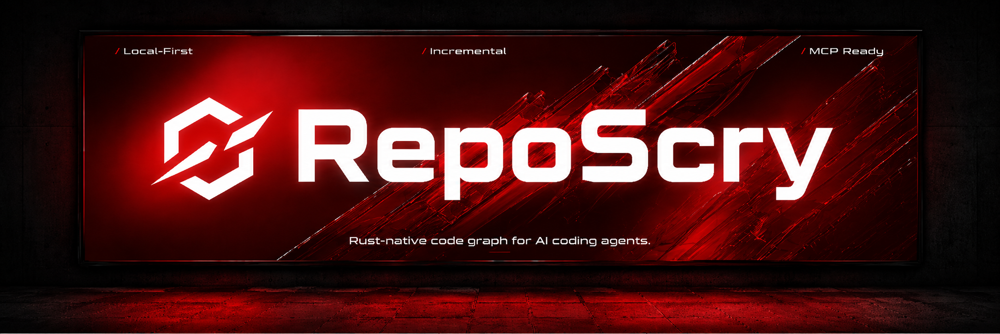

# RepoScry

<p align="center">
  
</p>

[](https://github.com/zibouddd/reposcry/actions/workflows/ci.yml)
[](https://github.com/zibouddd/reposcry/actions/workflows/release.yml)
[](https://crates.io/crates/reposcry-cli)
[](https://crates.io/crates/reposcry-cli)
[](https://github.com/zibouddd/reposcry/releases)
[](https://github.com/zibouddd/reposcry/stargazers)
[](LICENSE)

RepoScry is an early Rust-native local code graph for AI coding agents.

It is built for the edit loop: index the repository locally, generate a task-specific context pack, update only changed files after edits, and keep semantic/vector refresh outside the normal fast path.

Use it as a local repo-memory layer for Codex, Claude Code, Cursor, OpenCode, Aider, Gemini CLI, and MCP-compatible coding tools. It is not a magic production-grade code-understanding engine: call resolution is heuristic, dynamic/framework behavior is under-approximated, and some languages are indexed at file level only.

## Why RepoScry

AI coding agents often waste context rediscovering repository structure before every edit. RepoScry gives them a bounded local map first: relevant files, symbols, imports, dependencies, reverse dependencies, affected flows, and validation commands.

## What works today

| Capability                   | Status                                                                                                                            |
| ---------------------------- | --------------------------------------------------------------------------------------------------------------------------------- |
| Rust CLI                     | Native Rust binary, designed to run locally without a hosted service.                                                             |
| macOS/Linux/Windows binaries | Release workflow packages standalone archives for the main platforms when a tagged release is published.                          |
| Incremental update loop      | `reposcry-update` and `reposcry-watch` update changed files for agent/editor sessions.                                            |
| Separate semantic refresh    | Normal indexing can run without semantic/vector work; heavier semantic backends are opt-in.                                       |
| CRG-style workflows          | Includes commands for architecture overview, graph queries, impact radius, affected flows, semantic search, and refactor helpers. |
| MCP support                  | Includes a CRG-compatible MCP stdio server and an expanded read-only MCP-plus server.                                             |
| Graph export                 | Exports JSON, GraphML, lightweight HTML, and symbol graph JSON.                                                                   |

## What is still early

- Call resolution uses heuristics when multiple symbol matches are plausible.
- Dynamic imports, reflection, generated code, and framework runtime behavior are under-approximated.
- Some languages are indexed only at file/path/LOC/language level until parser extraction is added.
- Diff-based commands inspect git refs, not unstaged working tree edits.
- Heavy semantic backends such as Candle/Qwen3 can be slow on first run because model download and vector generation are outside the fast edit loop.
- Treat RepoScry as a practical local repo map for agents, not as a complete static-analysis replacement.

## Project stats

| Metric                   | Badge                                                                                                                                             |
| ------------------------ | ------------------------------------------------------------------------------------------------------------------------------------------------- |
| Crates.io version        | [](https://crates.io/crates/reposcry-cli)                                           |
| Crates.io downloads      | [](https://crates.io/crates/reposcry-cli)                                 |
| GitHub release downloads | [](https://github.com/zibouddd/reposcry/releases) |
| GitHub stars             | [](https://github.com/zibouddd/reposcry/stargazers)            |

## Binaries

| Binary              | Purpose                                                                                                              |
| ------------------- | -------------------------------------------------------------------------------------------------------------------- |
| `reposcry`          | Main CLI for indexing, graph analysis, context packs, reports, validation, search, MCP, and CRG-compatible commands. |
| `reposcry-update`   | Fast incremental updater for changed files or explicit file paths. Intended for edit loops and hooks.                |
| `reposcry-watch`    | Polling watch mode that runs incremental updates when Git reports changed files.                                     |
| `reposcry-export`   | Exports the cached graph as JSON, GraphML, or a lightweight HTML report.                                             |
| `reposcry-mcp-plus` | Expanded read-only MCP server for graph inspection tools.                                                            |

## Install

### macOS / Linux

```bash
curl -fsSLO https://raw.githubusercontent.com/zibouddd/reposcry/main/install.sh
bash install.sh
```

Pin a tagged release:

```bash
REPOSCRY_VERSION=v0.1.0 bash install.sh
```

### Windows PowerShell

```powershell
iwr https://raw.githubusercontent.com/zibouddd/reposcry/main/install.ps1 -OutFile install.ps1
./install.ps1
```

Pin a tagged release:

```powershell
$env:REPOSCRY_VERSION='v0.1.0'
./install.ps1
```

### From source

```bash
cargo install --path crates/reposcry-cli --force
```

After crates.io publication:

```bash
cargo install reposcry-cli
```

## Fast edit loop

Use this loop during normal coding. It avoids semantic/vector work by default.

```bash
reposcry init
reposcry index --no-semantic
reposcry context "fix dependency graph rebuild" --strict --budget 20000 --format markdown > .reposcry/AI_CONTEXT.md
```

After editing, update only changed files:

```bash
reposcry-update --changed --base main
reposcry validate main HEAD
```

Run a polling watch loop during an editor or agent session:

```bash
reposcry-watch --repo . --base main --refresh-search --skip-warm-calls
```

Run one watch iteration for hooks or CI:

```bash
reposcry-watch --repo . --once --json
```

Useful incremental flags:

| Flag                | Effect                                                                                    |
| ------------------- | ----------------------------------------------------------------------------------------- |
| `--changed`         | Include files from `git status --porcelain` and `git diff --name-only <base>`.            |
| `--file <path>`     | Update an explicit file. Can be repeated.                                                 |
| `--base <ref>`      | Diff base for `--changed`. Defaults to `HEAD`. Use `main` for branch work.                |
| `--skip-warm-calls` | Skip call-edge warmup for the fastest possible update.                                    |
| `--refresh-search`  | Rebuild lexical search documents after the file update. Semantic vectors are not rebuilt. |

## Full index workflow

```bash
reposcry --repo . index --no-semantic
reposcry --repo . warm-calls
reposcry --repo . stats
```

`index-full` emits a JSON summary for automation:

```bash
reposcry --repo . index-full --no-semantic
```

## Graph export

```bash
reposcry-export --repo . --format json --output .reposcry/graph.json
reposcry-export --repo . --format graphml --output .reposcry/graph.graphml
reposcry-export --repo . --format html --output .reposcry/graph.html
reposcry-export --repo . --format json --symbols --output .reposcry/graph-symbols.json
```

## Language support

RepoScry recognizes a broad language matrix. The first group has parser-backed extraction today; the second group is indexed at file/path/LOC/language level until deeper parser extraction is added.

| Support level      | Languages                                                                                                                |
| ------------------ | ------------------------------------------------------------------------------------------------------------------------ |
| Parser-backed      | Rust, TypeScript, TSX, JavaScript, JSX, Python, JSON, TOML, YAML                                                         |
| File-level indexed | Go, Java, C#, C, C++, Kotlin, Swift, PHP, Ruby, Lua, Dart, Scala, Vue, Svelte, Nix, PowerShell, Markdown, CSS, HTML, SQL |

Planned parser priorities: Go, Java, C#, Vue/Svelte, Kotlin/Swift.

See [docs/language-support.md](docs/language-support.md).

## Semantic refresh is separate

Semantic search is intentionally outside the normal edit loop.

```bash
reposcry refresh-search --semantic-backend local-hash-v1
reposcry semantic_search_nodes "cache database calls" --semantic --semantic-backend local-hash-v1
```

Heavier backends are opt-in:

```bash
REPOSCRY_SEMANTIC_BACKEND=fastembed reposcry refresh-search --semantic-backend fastembed
REPOSCRY_SEMANTIC_BACKEND=candle REPOSCRY_CANDLE_MODEL=qwen3 reposcry refresh-search --semantic-backend candle
```

## CRG-compatible commands

```bash
reposcry --repo . get_architecture_overview --format json
reposcry --repo . query_graph "callers_of rebuild_graph"
reposcry --repo . query_graph "tests_for parse_rust"
reposcry --repo . get_impact_radius rebuild_graph --depth 4
reposcry --repo . get_affected_flows main HEAD
reposcry --repo . semantic_search_nodes "cache database calls" --limit 20
reposcry --repo . refactor_tool rename parse_rust parse_rust_v2
```

## Agent setup

RepoScry can install project instructions and helper scripts for multiple AI coding tools.

Use the MCP-oriented install command when you want to install to all platforms by default:

```bash
reposcry install-mcp
reposcry install-mcp --platform cursor
reposcry install-mcp --platform claude --force
```

Install one platform:

```bash
reposcry install --platform codex
reposcry install --platform claude
reposcry install --platform cursor
```

Install every supported template:

```bash
reposcry install --platform all
```

Install only shared hook/helper scripts:

```bash
reposcry install --platform hooks
```

### Supported platforms

| Platform flag | Integration                                   |
| ------------- | --------------------------------------------- |
| `codex`       | OpenAI Codex / `AGENTS.md` style instructions |
| `claude`      | Claude Code on Linux/macOS                    |
| `windows`     | Claude Code on Windows                        |
| `cursor`      | Cursor project rules                          |
| `copilot`     | GitHub Copilot CLI style instructions         |
| `vscode`      | VS Code Copilot Chat project instructions     |
| `opencode`    | OpenCode agent instructions                   |
| `aider`       | Aider project conventions                     |
| `gemini`      | Gemini CLI / `GEMINI.md` instructions         |
| `kiro`        | Kiro steering instructions                    |
| `hermes`      | Hermes agent instructions                     |
| `kimi`        | Kimi Code instructions                        |
| `pi`          | Pi coding agent instructions                  |
| `claw`        | OpenClaw instructions                         |
| `droid`       | Factory Droid instructions                    |
| `trae`        | Trae instructions                             |
| `trae-cn`     | Trae CN instructions                          |
| `antigravity` | Google Antigravity instructions               |
| `hooks`       | Local Git/editor hook scripts only            |
| `all`         | All supported instruction templates           |

Generated integrations instruct agents to:

1. run `reposcry index --no-semantic` before broad exploration;
2. create `.reposcry/AI_CONTEXT.md` for the current task;
3. inspect dependencies and reverse dependencies before edits;
4. run `reposcry-update --changed --base main` after edit batches;
5. validate with `reposcry validate main HEAD`.

## MCP setup

Run the CRG-compatible MCP stdio server:

```bash
reposcry --repo /path/to/repo mcp
```

Run the expanded read-only MCP-plus server:

```bash
reposcry-mcp-plus --repo /path/to/repo
```

Example client configuration:

```json
{
  "mcpServers": {
    "reposcry": {
      "command": "reposcry",
      "args": ["--repo", "/path/to/repo", "mcp"]
    },
    "reposcry-plus": {
      "command": "reposcry-mcp-plus",
      "args": ["--repo", "/path/to/repo"]
    }
  }
}
```

`reposcry-mcp-plus` tools:

- `get_graph_summary`
- `list_languages`
- `list_files`
- `list_symbols`
- `get_file_neighborhood`
- `export_graph_json`

## What gets indexed

- files
- symbols
- imports
- file-level import edges
- call sites
- symbol-level call edges
- local full-text search documents
- optional semantic vectors

The SQLite cache lives in `.reposcry/reposcry.db`.

## Semantic backends

| Backend         | Variables                                                                                                  |
| --------------- | ---------------------------------------------------------------------------------------------------------- |
| `local-hash-v1` | default backend                                                                                            |
| `ollama`        | `REPOSCRY_OLLAMA_URL`, `REPOSCRY_OLLAMA_MODEL`                                                             |
| `fastembed`     | `REPOSCRY_FASTEMBED_MODEL`, `REPOSCRY_FASTEMBED_CACHE_DIR`                                                 |
| `candle`        | `REPOSCRY_CANDLE_MODEL`, `REPOSCRY_CANDLE_REPO`, `REPOSCRY_CANDLE_CACHE_DIR`, `REPOSCRY_CANDLE_MAX_LENGTH` |

`fastembed` and `candle` use `.reposcry/hf-home` as a writable Hugging Face cache root when `HF_HOME` is not set.

## Downloads

| Channel         | Purpose                                                                              |
| --------------- | ------------------------------------------------------------------------------------ |
| GitHub Releases | Standalone binaries for macOS, Linux, and Windows when release publication succeeds. |
| crates.io       | Source-based installation through Cargo after crate publication.                     |

[](https://github.com/zibouddd/reposcry/releases)
[](https://crates.io/crates/reposcry-cli)

## Benchmarks

```bash
bash scripts/bench.sh
python scripts/bench-code-review-graph.py --repo .
pipx install code-review-graph
python scripts/bench-code-review-graph.py --repo . --require-crg
```

The comparison runner writes JSON to `benchmarks/out/latest-code-review-graph-compare.json`.

Published notes live in [BENCHMARKS.md](BENCHMARKS.md).

## Star history

[](https://www.star-history.com/#zibouddd/reposcry&Date)

## Release

```bash
git tag v0.1.0
git push origin v0.1.0
```

The release workflow packages all binaries and publishes checksums.

If GitHub release creation fails with `Resource not accessible by integration`, enable **Settings → Actions → General → Workflow permissions → Read and write permissions** or publish with a token that has `contents: write`.

## Release smoke

```bash
bash scripts/smoke-release.sh
```

On Windows:

```powershell
./scripts/smoke-release.ps1
```

## Documentation

- [docs/architecture.md](docs/architecture.md)
- [docs/mcp.md](docs/mcp.md)
- [docs/benchmarks.md](docs/benchmarks.md)
- [docs/code-review-graph-compat.md](docs/code-review-graph-compat.md)
- [docs/language-support.md](docs/language-support.md)

## Limitations

- Dynamic imports, reflection, and framework runtime behavior are under-approximated.
- Call resolution still uses heuristics when multiple symbol matches are plausible.
- Newly recognized languages without parser support are indexed at file/path/LOC/language level only.
- Diff-based commands such as `detect_changes main HEAD` inspect git refs, not unstaged working tree edits.
- Heavy semantic backends such as Candle/Qwen3 can be slow on first run because model download and vector generation are outside the fast edit loop.
- End-to-end release publication requires a tagged GitHub release workflow run.
